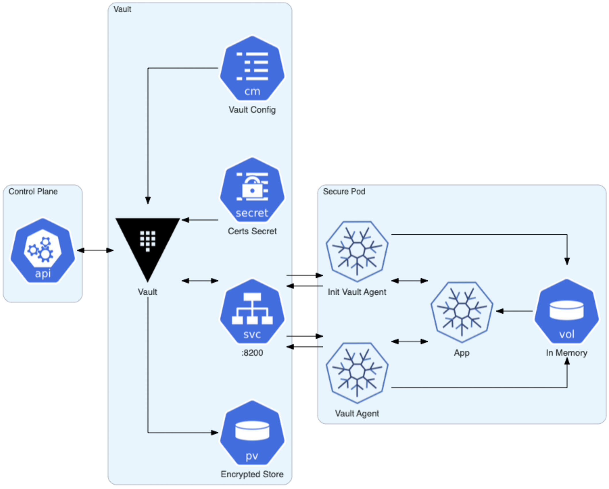
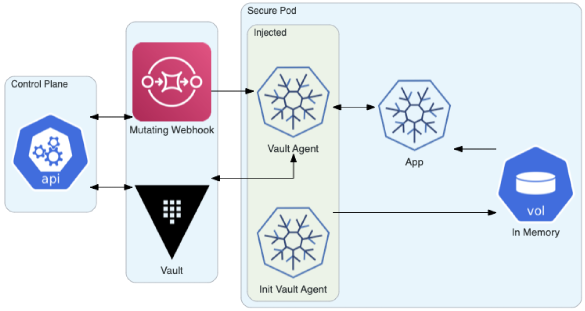

# Lab2: Setup Internal Vault with Agent Injector on OpenShift

## Setup Helm v3

In the IBM Cloud shell create an alias for Helm v3,

```bash
alias helm=helm3
```

## Connect to OpenShift

```bash
oc login --token=<your-openshift-token> --server=<your-openshift-cluster-url>
```

Create a new project or namespace to install Vault,

```bash
VAULT_NAMESPACE=my-vault-0
oc new-project $VAULT_NAMESPACE
```

## Install Vault using Helm Chart

The recommended way to run Vault on OpenShift is using the Helm Chart.

```bash
helm repo add hashicorp https://helm.releases.hashicorp.com
```

Create a custom values.yaml file to set custom defaults for the Vault Helm chart. The full default values.yaml for Vault Helm chart is found at [hashicorp/vault-helm](https://github.com/hashicorp/vault-helm/blob/master/values.yaml).

In the `postStart` hook, in Vault enable Kubernetes authentication and configure Vault to securely communicate with OpenShift.

```bash
echo '# Custom values for the Vault chart
global:
  # If deploying to OpenShift
  openshift: true
server:
  dev:
    enabled: true
  serviceAccount:
    create: true
    name: vault-sa
injector:
  enabled: true
authDelegator:
  enabled: true' > my_values.yaml
```

By default, the `injector.enabled` parameter is set to `true`. So together with Vault, the Helm chart installed a Vault Agent Injector Admission Webhook Controller in Kubernetes.

By default, the `global.openshift` parameter is set to `false`. If set to `true`, it enables configuration specific to OpenShifta such as a NetworkPolicy, SecurityContext, and Route.

By default, the `server.dev.enabled` parameter is set to false. To enable the `dev` mode for the Vault server, you can experiment with Vault without needing to unseal.

A Vault server normally starts in a sealed state. A sealed Vault server can access the physical storage, but cannot decrypt the data. When you unseal Vault, you allow access by giving the plaintext master key necessary to read the decryption key to decrypt the data.

The `authDelegator.enabled` parameter binds a Cluster Role Binding to the Vault ServiceAccount. This Cluster Role Binding has the necessary privileges for Vault to use the Kubernetes Auth Method.

Install the Vault Helm chart using the `values.yaml` file to define custom configuration values,

```bash
helm install vault hashicorp/vault -n $VAULT_NAMESPACE -f my_values.yaml
```

Verify the installation was successful,

```bash
$ oc get pods
NAME                                    READY   STATUS    RESTARTS   AGE
vault-0                                 1/1     Running   0          13s
vault-agent-injector-588c48db4b-h9xfv   1/1     Running   0          13s
```

After installation of Vault, `exec` into the Vault pod and configure Kubernetes authentication,

```bash
$ oc exec -it vault-0 -- /bin/sh

vault auth enable kubernetes
JWT=$(cat /var/run/secrets/kubernetes.io/serviceaccount/token)
echo $HWT
HOST="https://$KUBERNETES_PORT_443_TCP_ADDR:443"
echo $HOST
CA_CERT=@/var/run/secrets/kubernetes.io/serviceaccount/ca.crt
echo $CA_CERT
vault write auth/kubernetes/config token_reviewer_jwt=$JWT kubernetes_host=$HOST kubernetes_ca_cert=$CA_CERT
```

## Vault Agent

The Vault Agent performs three functions:

1. It authenticates with Vault using the Kubernetes authentication method.
1. It stores the Vault token in a `sink file` like `/var/run/secrets/vaultproject.io/token`, and keeps it valid by refreshing it at the appropriate time.
1. The `template` allows Vault secrets to be rendered to files using `Consul` Template markup.

The Vault Agent runs as an init sidecar container and shares an in-memory volume in which the token is retrieved. The shared memory volume is mounted to `/vault/secrets` and used by the Vault Agent containers for sharing secrets with the other containers in the pod.


source: [https://www.openshift.com/blog/integrating-hashicorp-vault-in-openshift-4](https://www.openshift.com/blog/integrating-hashicorp-vault-in-openshift-4)

The [Mutating Webhook Vault Agent Sidecar Injector](https://www.vaultproject.io/docs/platform/k8s/injector) automatically injects sidecar containers using a Kubernetes mutating admission controller. The [vault-k8s](https://github.com/hashicorp/vault-k8s/) binary integrates Vault and Kubernetes.

The Vault Agent Injector works by intercepting pod `CREATE` and `UPDATE` events in Kubernetes. The controller parses the event and looks for the metadata annotation `vault.hashicorp.com/agent-inject: true`. If found, the controller will alter the pod specification based on other annotations present.

Two types of Vault Agent containers can be injected: init and sidecar. The init container will prepopulate the shared memory volume with the requested secrets prior to the other containers starting. The sidecar container will continue to authenticate and render secrets to the same location as the pod runs. Using annotations, the initialization and sidecar containers may be disabled.

two additional types of volumes can be optionally mounted to the Vault Agent containers. The first is secret volume containing TLS requirements such as client and CA (certificate authority) certificates and keys. The second is a configuration map containing Vault Agent configuration files. This volume is useful to customize Vault Agent beyond what the provided annotations offer.

The primary method of authentication with Vault when using the Vault Agent Injector is the service account attached to the pod. For Kubernetes authentication, the service account must be bound to a Vault role and a policy granting access to the secrets desired.

One of two methods of configuring the Vault Agent containers to render secrets can be used:

* the `vault.hashicorp.com/agent-inject-secret` annotation, used in this tutorial, or
* a configuration map containing Vault Agent configuration files.

To configure secret injection, add:

* one or more secret annotations, and
* the Vault role for accessing the secrets.

The annotation must have the format:

```yaml
vault.hashicorp.com/agent-inject-secret-<unique-name>: /path/to/secret
```


source: [https://www.openshift.com/blog/integrating-hashicorp-vault-in-openshift-4](https://www.openshift.com/blog/integrating-hashicorp-vault-in-openshift-4)

## PostStart

You could alternatively have included the post installation configuration commands in a postStart hook of the values.yaml,

```yaml
  postStart:
    - /bin/sh
    - -ec
    - >
      sleep 5;
      vault auth enable kubernetes;
      vault write auth/kubernetes/config token_reviewer_jwt="$(cat /var/run/secrets/kubernetes.io/serviceaccount/token)" kubernetes_host="https://$KUBERNETES_PORT_443_TCP_ADDR:443" kubernetes_ca_cert=@/var/run/secrets/kubernetes.io/serviceaccount/ca.crt
```

Container lifecycle hooks in Kubernetes run code implemented in a handler that are triggered by container lifecycle events. Two container hooks are exposed to containers: `PostStart` and `PreStop`.

The `PostStart` parameter enables the Kubernetes `postStart` hook, which executes commands immediately after a container is created, but there is no guarantee that the hook will execute before the container ENTRYPOINT. A related `PreStop` hook is executed before a container is terminated due to an API request or management event. If either a PostStart or PreStop hook fails, it kills the Container. If a handler fails for some reason, it broadcasts an event. For PostStart, this is the `FailedPostStartHook` event, and for PreStop, this is the `FailedPreStopHook` event. For more detail, see the [Termination of Pods](https://kubernetes.io/docs/concepts/workloads/pods/pod-lifecycle/#pod-termination).

Congrats! You have installed Vault and the Vault agent injector. You are ready to consume encrypted secrets in your app.
